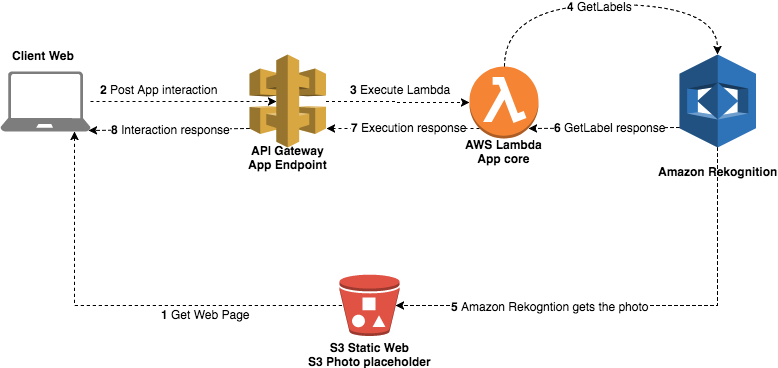
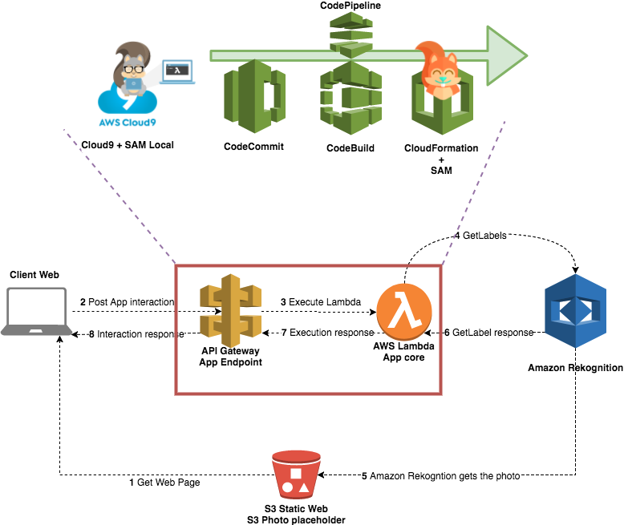
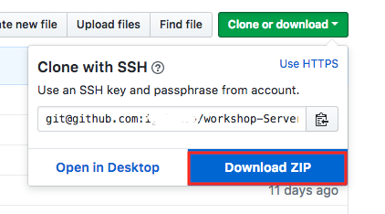

# ServerlessOps Workshop

Serverless is the last iteration of reducing the cost and improving the efectiviness of the team. You can now focus on what really matters. Your business. 

Serverless computing allows you to build and run applications and services without thinking about servers. Serverless applications don't require you to provision, scale, and manage any servers. You can build them for nearly any type of application or backend service, and everything required to run and scale your application with high availability is handled for you.

However, as [Ben Kehoe](https://www.slideshare.net/BenKehoe/serverless-operations-for-the-irobot-fleet) mentions during his sessions, Serverless doesn't mean **no ops**. It is **Different Ops**.

During the course of this workshop we will cover step by step some of the basic knowledge to operate Serverless applications on AWS. This includes the basis of Serverless Operations like "how to manually create a pipeline" or "review a SAM template", "debug your code with SAM Local", "blue green deployments" or even "API Canary releases". Basic starting points for your day to day operations. Are you ready? Let's start with the operation!

## Requirements

This workshop requires:

- AWS knowledge. There are a lot of workshops that cover different services and introductions to AWS. Within this workshop we expect basic knowledge of AWS.
- Experience with Serverless services such as AWS Lambda, DynamoDB, API Gateway or Cognito.
- An active AWS Account with administrative permissions.
- If you are using your own development environment, you should have [npm](https://docs.npmjs.com/getting-started/installing-node) and [git](https://git-scm.com/book/en/v2/Getting-Started-Installing-Git) installed.

We won't cover these topics during this workshop. If you need some extra help with this, we recommend you visit these other resources:

- [Serverless 101 workshop - Wild Rydes Web Application](https://github.com/awslabs/aws-serverless-workshops/tree/master/WebApplication)
- [Introduction to AWS](https://aws.amazon.com/es/about-aws/whats-new/2014/01/14/new-introduction-to-aws-instructional-videos-and-labs/)
- [SAM documentation](https://github.com/awslabs/serverless-application-model)

## The application workflow

Here you can see a diagram with the workflow of the application we will deploy:

From the webpage we are going to deploy, we will perform a POST request to our API. This API will trigger a Lambda that, initially, will get the Labels on the image showed on our web app and finally, we will show these labels on the web.

However, this is not the important part. Let's take a look at this new diagram:

## Introduction

To start, please download the zip file with the content on this GitHub. To do this, under the green button, use *Clone or Download*

Then, you can start with the first step:

1. [Preparing the environment](documentation/1_preparing_environment)
2. [Develop with Cloud9](documentation/2_develop_with_cloud9)
3. [Building your CI/CD pipeline](documentation/3_building_your_ci_cd_pipeline)
4. [Operations: Advanced Features](documentation/4_operations_advanced_features)
5. [Closing and next steps](documentation/5_closing_and_next_steps).