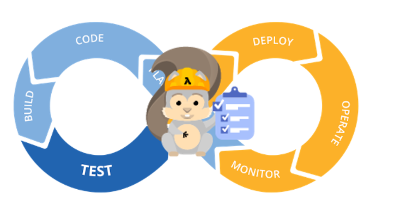

# ServerlessOps Workshop



### *Under develop*:


--------
Check [issues tab](../../issues)

--------


In this session you will learn the basis of Serverless and the starting set for every developer. We will go through all the steps from local development to continuous delivery using our favourite AWS Serverless Services.


## Step 1: Introduction - What is Serverless?

<details><summary> Click here to toggle out this section</summary>

In this part of the presentation, if the customers know what is serverless, let's talk about their workloads. **What are they doing/planning to do with Serverless?**

Pysical Servers -> Virtual Machines -> Containers -> **Serverless**

Serverless computing allows you to build and run applications and services without thinking about servers. Serverless applications don't require you to provision, scale, and manage any servers. You can build them for virtually any type of application or backend service, and everything required to run and scale your application with high availability is handled for you.

Building serverless applications means that your developers can focus on their core product instead of worrying about managing and operating servers or runtimes, either in the cloud or on-premises. This reduced overhead lets developers reclaim time and energy that can be spent on developing great products which scale and that are reliable.

- Functions as the unit of scale
- Explain Serveless Paradigm is change of mindset.
- Serverless is still growing.


### Step 1.2: Services we are going to use:
#### Step 1.2.1: AWS Lambda

AWS Lambda is a compute service that lets you run code without provisioning or managing servers. 

- Runs on Amazon Handled Container.
- Languages we support
- AWS Lambda Ensures function is executed in parallel and at scale

**Key knowledge bulletpoints:**

- Your code
 - Lamda handler
 - Uploading code vs. the widget.
- The trigger
- Execution Role
- Enviromental Variables
- Timeout
- Memory
- VPC
- DLQ for failed requests


#### Step 1.2.2: Api Gateway

Amazon API Gateway is a fully managed service that makes it easy for developers to create, publish, maintain, monitor, and secure APIs at any scale.

1. Create a unified API frontend fro multiple microservices
2. DDoS protection and throttling for backend systems
3. Authenticate and authorize requests.
4. Integration with Lambda.
5. Change the payload.
6. Custom error codes - Abstract the app layer from the API
7. Swagger compatible


#### Step 1.2.3: SAM - Serverless Application Model

SAM is an abstraction on CloudFormation

- New resource types AWS::Serverless::*
- Transformed to standard CloudFormation as a ChangeSet
- You can mix standard CloudFormation and Serverless resources in the same template
 
SAM makes easier to create applications!

sam validate - validates a Serverless SAM template
sam package - aws cloudformation package
sam deploy - aws cloudformation deploy


#### Step 1.2.4: SAM Local

Let's start from the begining! Local development.
SAM Local can be used to test functions locally, start a local API Gateway from a SAM template, validate a SAM template, and generate sample payloads for various event sources.


### Step 1.3: Install SAM Local -- Section to replace with Cloud9


 - https://github.com/awslabs/aws-sam-local
 - Introduce Visual Studio Code as we are going to use it for this session.

 
### Step 1.4: SAM Local -- Section to replace with Cloud9


**Invoking function with event file:**

`sam local invoke "Ratings" -e event.json`

**Generate sample event source payloads**

`sam local generate-event <service>`
`sam local generate-event "S3" | sam local invoke "Ratings"`
**Run API Gateway locally**

`sam local start-api`

**Debug your Lambda**
Set your configuration on Visual Studio Code:

```
{
    "version": "0.2.0",
    "configurations": [
        {
            "name": "Attach to SAM Local",
            "type": "node",
            "request": "attach",
            "address": "localhost",
            "port": 5858,
            "localRoot": "${workspaceRoot}/(you-function)",
            "remoteRoot": "/var/task"
        }
    ]
}
```
Invoke the Lamda to debug

```
sam local invoke -d 5858 <function logical id>
sam local start-api -d 5858
```

</details>

## Step 2: Building the Pipeline!
### Step 2.1: Create S3 Bucket for deployments.

Create an S3 bucket where your deployments are going to be uploaded. Use a name such as:

```
serverless-ops-my-deployments-<your-alias-here>
```

Within the code, go to `buildspec.yaml` and change the S3 bucket to the one you have just created.

### Create IAM git credentials - SSH

### Step 2.2: Create a CodeCommit repository.

1. Go to the CodeCommit repository and click on **Create Repository**
2. Enter a repository name such as **ServerlessOps_Repository**
3. Skip Configure email notifications' step.
4. Follow the steps provided by CodeCommit to **Connect to your repository**
5. Copy the content of the folder **ServerlessOps_workshop** to the recently created **ServerlessOps_Repository**
6. Run these commands to perform the inital commit:

### Git clone + unzip + next steps

!Insert images here.

````bash
git add -A
git commit -m "initial commit"
git push
````
Now your code is CodeCommit and you start building your pipeline.

##### Note: The *yaml* template - SAM!

The folder with the code has the following tree:

    ├── README.md
    ├── *buildspec.yml*
    ├── documentation
    │   └── images
    │       └── ...
    ├── frontend
    │   ├── assets
    │   │   └── ...
    │   ├── front-js
    │   │   ├── assets.js
    │   │   └── ...
    │   ├── *index.html*
    │   └── ...
    ├── functions
    │   ├── getinfo
    │   │   └── *index.js*
    │   └── getinfoenhanced
    │       └── *index.js*
    ├── old
    │   └── ...
    ├── swagger.yaml
    └── *template.yaml*

The important files here are represented by *name of the file *.

The SAM template is called **template.yaml** and has two resources:
1. An API
2. A function

The function has an API method defined in the API as the event trigger. This method is define in the file **swagger.yaml** as well as some other features such as CORS.

During this Lab we will modify the function **"getinfo"** with the code within **"getinfoenhanced"** to demonstrate how can propagate a change within the pipeline and deploy it in a Blue/Green matter.


## Step 2.3: Creating the pipeline with CodePipeline

Before you start, change the file ```buildspec.yml``` to add your alias in the command.


1. Go to the CodePipeline console and click on **Get Started**
2. Create a Pipeline with the name **ServerlessOps_pipeline** and click on next step.


### Step 2.3.1 Create the source of your pipeline.

3. Drop down the service provider and select **CodeCommit**.
4. Look for the repository name created previously and select it.
5. Select the Branch name **master**.


After defining our source, we will chose **CodeBuild** as our build provider. Click on Next Step.

### Step 2.3.2: How to create a CodeBuild project for your serveless pipeline

Here we are going to select the build provider. In this case, we will use CodeBuild.

In the phase of creating a build project, we select "Create a new build project".

Within the project, the file buildspec.yml has the information necesary for your deployments. If we inspect this file, we will find that the deployment generages a file calles SAM-template.yaml which replaces the "local code" with a file within the S3 bucket previously provided.

1. Name it as *ServerlessOps_build*.
2. Select *Use an image managed by AWs CodeBuild*.
3. Chose *Ubuntu* as the Operating system.
4. Select *Node.js* as the runtime.
5. Select Version *4.3.2*.
3. Select *Create a service role in your account*. We will review it after creating the pipeline.
4. Click on *Save build project*


### Step 2.3.3: Select the deploy phase using CloudFormation.

Click on Next Step once you have created your build project. Altough SAM (behind the scenes) will use CodeDeploy, SAM is based in CloudFormation and the deploy will do it as well.

1. Select *CloudFormation* as the deployment provider.
2. Chose *Change or replace a change set* as the Action Mode.
3. Name the Stack **ServerlessOps-stack**
4. Name the Change set as **ServerlessOps-changeset**
5. The template file that CodeBuild generates is *SAM-template.yaml*. Set it under Template file.
6. Select Capabilities *CAPABILITIES_IAM*
7. This is the role assumed by CloudFormation to deploy your code. For the shake of this training, we will use Administration permissions. Please bare in mind that these permissions should be the ones used by your stack (such as creating an API, Lambda Function, S3...). *Create/use an IAM role for CloudFormation with Administrator permissions*.
8. In the next step we will *define the role used by CodePipeline* to access resources such as CodeBuild, CodeCommit, S3... If you have created a role previously, you can use it, if not click on Create role. By allowing the default policy, it will create a role called *AWS-CodePipeline-Service*. Then, click *Next Step*.
9. Review the configuration and create the pipeline.


### Step 2.3.4: Review the CodeBuild IAM role to add S3 Permissions.

The IAM role created by CodeBuild doesn't have the specific permissions for the instruction needed on it's buildspec.yml:

```
aws cloudformation package --template-file template.yaml --s3-bucket  serverless-ops-my-deployments-<your-alias> --output-template-file SAM-template.yaml
```

After creating the pipeline, you will see that it fails during the build phase due to a permissions issue. We need to add these permissions (S3).

1. Go to the IAM Console and look for the role.
2. Attach an S3 administator policy to this role.


<details><summary>CodeBuild Role:</summary>

```JSON
{
    "Version": "2012-10-17",
    "Statement": [
        {
            "Effect": "Allow",
            "Resource": [
                "arn:aws:logs:us-east-1:012345678901:log-group:/aws/codebuild/from-sam-to-aws",
                "arn:aws:logs:us-east-1:012345678901:log-group:/aws/codebuild/from-sam-to-aws:*"
            ],
            "Action": [
                "logs:CreateLogGroup",
                "logs:CreateLogStream",
                "logs:PutLogEvents"
            ]
        },
        {
            "Effect": "Allow",
            "Resource": [
                "arn:aws:s3:::codepipeline-us-east-1-*"
            ],
            "Action": [
                "s3:PutObject",
                "s3:GetObject",
                "s3:GetObjectVersion"
            ]
        },
        {
            "Effect": "Allow",
            "Action": "s3:*",
            "Resource": "arn:aws:s3::012345678901:nameofyourbucket"
        },
        {
            "Effect": "Allow",
            "Action": [
                "ssm:GetParameters"
            ],
            "Resource": "arn:aws:ssm:us-east-1:012345678901:parameter/CodeBuild/*"
        }
    ]
}
```

</details>

### Now, go to CloudFormation, execute change set.

## Step 3: The front end.

In order to make this web page available for every customer, we will have to upload it to S3. 

### Step 3.1: Prepare the front-end. 

The first step is to modify the javascript to point to the API created by your pipeline and the image to review. 

1. Go to the AWS API Gateway console.
2. Select the API *ServerlessOps-api*.
3. Under Stages, select *Prod*.
4. Copy the Invoke URL presented there.
5. Open the file under the project tree: 

	```
	ServerlessOps > frontend > front-js > assets.js
	```
6. Change the variable api with the URL copied before.


### Step 3.2: Upload the front-end.

Now, let's upload this content to S3.

1. Create bucket called:

	```
	serverless-ops-frontend-<your-alias>
	```
1. Upload all the content within the folder *frontend*.

	Configure your bucket for Website hosting by following these 3 simple steps in our documentation:

 - https://docs.aws.amazon.com/AmazonS3/latest/dev/HowDoIWebsiteConfiguration.html

1. Change the bucket name and confirm that the image is in the bucket. (the image should be in the same bucket as the front-end).

Now we should be able to open the application locally by opening the file:

```
ServerlessOps > frontend > index.html
```


Now, go to your application and test it!

## Step 4: Update your code to force a release!

Let's make our first release. We could simply use a release change within the pipeline console but, in order to demonstrate the automation, we will do it directly from the console/git command:

1. Run the following git commands:

	```
	git add -A
	git commit -m "My first commit! - ServerlessOps"
	git push
	```

2. Go back to the CodePipeline Console to see the release.

The code will stop at staging, yet the Pipeline won't have generated any resources such as APIs, Lambdas... Why? Because the Pipeline should have generated a ChangeSet. You can go to CloudFormation, select the stack and execute the change set.

A final stage should be added to the pipeline. ExecuteChangeSet is required.

1. On the CodePipeline console, click on *Edit*.
2. At the bottom of your pipeline, click on the icon *+ Stage*.
3. Enter a stage name like *ExecuteChangeSet*.
4. Click on Action.
5. Under Action Category, select *Deploy*.
6. Name the action *ExecuteChangeSet*.
7. The deployment provider will be CloudFormation.
8. Under Action mode, select *Execute a change set*.
9. Select the stack and the Change set name.
10. Save the Stage and click on *Save pipeline changes*.

Now, it's time to make a change. Our web application is clearly incomplete! We need to find out the celebrities in our photo!

To do this, we need to change the code behind this file:
 
 ```
 functions/getinfo/index.js
 ```
With the content within

```
functions/getinfoenhanced/index.js
```

After doing it, we need to commit these changes. Use the previously mentioned git commands to push the code to git commit:
 
```
git add -A
git commit -m "Adding celebrities to the result."
git push
```

## Step 5: Let's review our deployment!

Now that we have made a change on our code it should be reflected on the result. But wait... Does it? No! We are B/G deploying it! Follow these steps:

1. Go to CodeDeploy and select the deployment that starts with ServerlessOps-stack.
2. Under status, you should see an identifies starting with "d-". Click it.


We are shifting traffic 10% each minute! This has been done using 3 lines on sam:

```
AutoPublishAlias: live
      DeploymentPreference:
        Type: Linear10PercentEvery1Minute
```

You can run tests against the application to find see the different requests.


## Step 6: Set concurrency in your Lambda Function.

AWS Lambda limits your concurrency to 1000 concurrent executions within one region. Of course, these limits can be updated by requesting a limit increase to our support team. However, it is always a good idea to limit your functions to certain amount of concurrent executions. 

Let's put an example: We have our own environment with several developers pushing code and testing lambda functions. We are deeply into Serverless! Some of these functions are just for testing purposes but one of our developers is doing a load test to see how does it react to heavy load. Because of this, his tesing lambda function is taking 900 concurrent executions letting only 100 left for the rest of your Lambda functions. Luckily, you followed the best practices and split testing and production in two different accounts so this is not impacting your production environment but, of course, the rest of the developers are seeing 429 in the Lambda execution whenever they trigger their functions. You got several angry developers! How can we avoid this?

Another use case would be to "reserve" capacity for our Lambda function so other executions won't take it.

For the purpose of this workshop, we are going to limit the concurrency of our function to 25. You probably noticed in the code that there is "wait" of 3000 seconds.

```JAVASCRIPT
setTimeout(function(){...
},3000);
```
This has been made on purpose to force your Lambda function to have concurrent executions.

Let's test our Lambda Function without concurrency. To do it, we recommend you to use an EC2 instance so you can install hey easily.

```bash
## If you don't have go installed:
sudo yum install go -y
## mac with brew
brew install go
##

go get -u github.com/rakyll/hey

./go/bin/hey -n 1000 -c 50 \
-d '{ "bucket": "serverless-ops-frontend-<your-alias-here>","key": "someguy.jpg"}' \ 
-H 'Content-Type: application/json' -m POST https://<your-api-endpoint>/Prod/getinfo
```

At this point, this code should have been released. Let's manually set the concurrency for our Lambda Function.

1. Go to the Lambda Console.
2. Select the Lambda Function deployed by our SAM template (starts with *ServerlessOps-stack-LambdaFunction-)*.
3. Under Configuration tab, set the concurrency to 25.


4. Save the function.

It is important to understand that this concurrency is shared between all the aliases and versions of this function. Lambda concurrency is function based.

To test this concurrency, let's go to our terminal and run the previous command command.


```bash
./go/bin/hey -n 1000 -c 50 \
-d '{ "bucket": "serverless-ops-frontend-<your-alias-here>","key": "someguy.jpg"}' \ 
-H 'Content-Type: application/json' -m POST https://<your-api-endpoint>/Prod/getinfo
```

You will definitely see something like this:

```bash
Response time histogram:
  0.083 [1]	|
  1.548 [500]	|∎∎∎∎∎∎∎∎∎∎∎∎∎∎∎∎∎∎∎∎∎∎∎∎∎∎∎∎∎∎∎∎∎∎∎∎∎∎∎∎
  3.012 [0]	|
  4.476 [457]	|∎∎∎∎∎∎∎∎∎∎∎∎∎∎∎∎∎∎∎∎∎∎∎∎∎∎∎∎∎∎∎∎∎∎∎∎∎
  5.941 [15]	|∎
  7.405 [5]	|
  8.869 [1]	|
  10.334 [0]	|
  11.798 [0]	|
  13.262 [3]	|
  14.727 [18]	|∎
  
  ...
  Status code distribution:
  [502]	501 responses
  [200]	499 responses
```
As we can see here, the 502's responses has increased! 
  
  