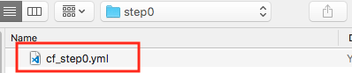
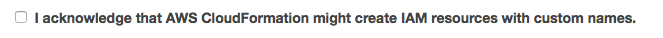

# 1. Preparing the environment

In order to ease the workshop we have created a CloudFormation Stack that deploys the following assets:

- A S3 bucket used for SAM deployments.
- A S3 public web site bucket to host the frontend application.
- A bucket policy for the previous bucket.
- An IAM Role used by **CodeBuild** to access assests generated by SAM, receive and deliver messages from CodePipeline and execute CloudFormation actions.
- An IAM Role used by CloudFormation to deploy all the assets of the application.

## 1.1. Environment CloudFormation.

### 1.1.1: Deploy the Step 0 CloudFormation Stack.

To deploy these assets go to the step0 folder and find the following file:



Click on one of the following links. Beware! This will be the region you will use during the rest of the workshop!

Region| Launch
------|-----
US East (N. Virginia) | [](https://console.aws.amazon.com/cloudformation/home?region=us-east-1#/stacks/new?stackName=serverlessops-step0-stack&templateURL=https://s3.amazonaws.com/igngar/public/serverlessops-workshop/cf_step0.yml)
US East (Ohio) | [](https://console.aws.amazon.com/cloudformation/home?region=us-east-2#/stacks/new?stackName=serverlessops-step0-stack&templateURL=https://s3.amazonaws.com/igngar/public/serverlessops-workshop/cf_step0.yml)
US West (Oregon) | [](https://console.aws.amazon.com/cloudformation/home?region=us-west-2#/stacks/new?stackName=serverlessops-step0-stack&templateURL=https://s3.amazonaws.com/igngar/public/serverlessops-workshop/cf_step0.yml)
EU (Frankfurt) | [](https://console.aws.amazon.com/cloudformation/home?region=eu-central-1#/stacks/new?stackName=serverlessops-step0-stack&templateURL=https://s3.amazonaws.com/igngar/public/serverlessops-workshop/cf_step0.yml)
EU (Ireland) | [](https://console.aws.amazon.com/cloudformation/home?region=eu-west-1#/stacks/new?stackName=serverlessops-step0-stack&templateURL=https://s3.amazonaws.com/igngar/public/serverlessops-workshop/cf_step0.yml)
EU (London) | [](https://console.aws.amazon.com/cloudformation/home?region=eu-west-2#/stacks/new?stackName=serverlessops-step0-stack&templateURL=https://s3.amazonaws.com/igngar/public/serverlessops-workshop/cf_step0.yml)
Asia Pacific (Tokyo) | [](https://console.aws.amazon.com/cloudformation/home?region=ap-northeast-1#/stacks/new?stackName=serverlessops-step0-stack&templateURL=https://s3.amazonaws.com/igngar/public/serverlessops-workshop/cf_step0.yml)
Asia Pacific (Seoul) | [](https://console.aws.amazon.com/cloudformation/home?region=ap-northeast-2#/stacks/new?stackName=serverlessops-step0-stack&templateURL=https://s3.amazonaws.com/igngar/public/serverlessops-workshop/cf_step0.yml)
Asia Pacific (Sydney) | [](https://console.aws.amazon.com/cloudformation/home?region=ap-southeast-2#/stacks/new?stackName=serverlessops-step0-stack&templateURL=https://s3.amazonaws.com/wildrydes-ap-southeast-2/WebApplication/1_StaticWebHosting/webapp-static-hosting.yaml)
Asia Pacific (Mumbai) | [](https://console.aws.amazon.com/cloudformation/home?region=ap-south-1#/stacks/new?stackName=serverlessops-step0-stack&templateURL=https://s3.amazonaws.com/wildrydes-ap-south-1/WebApplication/1_StaticWebHosting/webapp-static-hosting.yaml)


1. In the **CloudFormation** Console and click on Next.
2. Verify the Stack name ```serverlessops-step0-stack```, write your **Alias** and click continue. Make sure you enter an **Alias** as it will be used to create your S3 bucket and also ensure that your **Alias** is unique among everyone so chose it wisely.
3. Once you are in the final option page, enable CloudFormation to create IAM resources:



## 1.2: Change the buildspec.yaml to add S3 deployments.

The CloudFormation stack will create an S3 bucket for deployments with the following

```
serverlessops-deploymentbucket-<your-alias-here>
```

Now we have to go to `buildspec.yaml`. You will find it in the root folder, of the ZIP you downloaded on previous steps. Change the S3 bucket to the one you have just created. Basically, add the alias you added to the CloudFormation here.

## 1.3. Upload your web page

During the course of this workshop we will use this web page as the application we will be changing over time. In this case, upload all the content under *frontend* to the S3 bucket created by **step 1.1.1**.

You can use this command once you are within the *frontend* folder:

```bash
aws s3 cp . s3://serverlessops-step0-stack-serverlessopsfrontend-<random-string> --recursive
```

Of course, you need to change <random-string> with your actual bucket.

Once you have finished this step you can start the second step [here](../../documentation/2_develop_with_cloud9).
