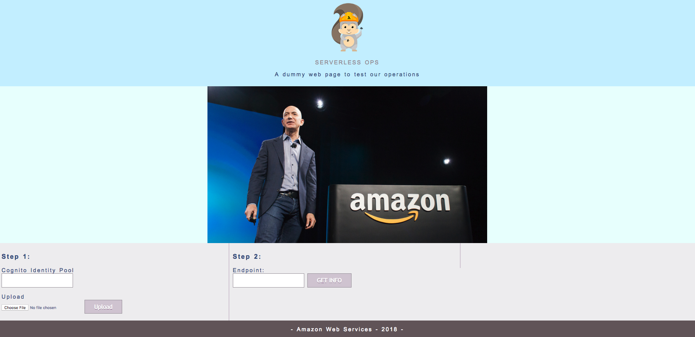
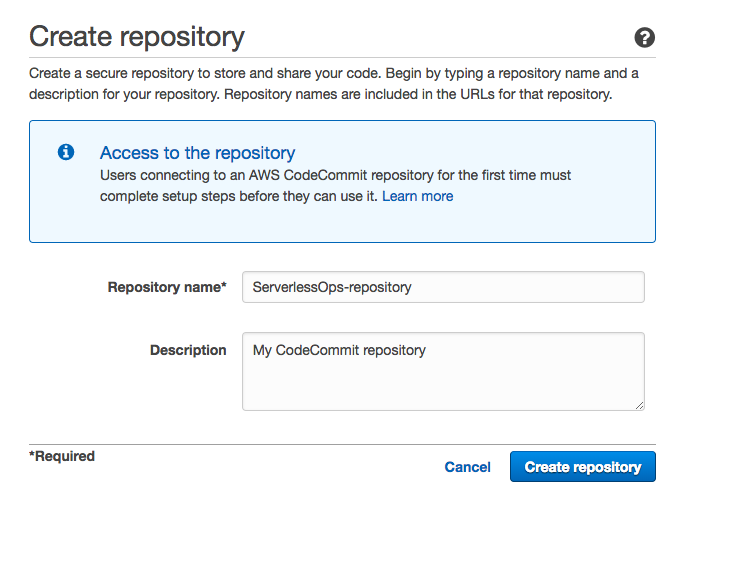

# 1. Preparing the environment

In order to ease the workshop we have created a CloudFormation Stack that deploys the following assets:

- A S3 bucket used for SAM deployments.
- A S3 public web site bucket to host the frontend application.
- A bucket policy for the previous bucket.
- An IAM Role used by **CodeBuild** to access assests generated by SAM, receive and deliver messages from CodePipeline and execute CloudFormation actions.
- An IAM Role used by **CloudFormation** to deploy all the assets of the application.

In this section we will also create a Git repository on CodeCommit. We will cover this later in the workshop.

- [1.1. Environment CloudFormation](#11-Environment-CloudFormation)
- [1.2. Review the frontend](#12-Review-the-frontend)
- [1.3. Create a repository in CodeCommit](#13-Create-a-repository-in-CodeCommit)

## 1.1. Environment CloudFormation.

### 1.1.1: Deploy the Step 0 CloudFormation Stack.

To deploy these assets go to the step0 folder and find the following file:


Click on one of the following links. Beware! This will be the region you will use during the rest of the workshop!

Region| Code | Launch
------|------|-------
EU (Ireland) | eu-west-1 | [](https://console.aws.amazon.com/cloudformation/home?region=eu-west-1#/stacks/new?stackName=serverlessops-step0-stack&templateURL=https://s3-eu-west-1.amazonaws.com/serverlessops-functions-eu-west-1/cfn/cf_step0.yml)


1. In the **CloudFormation** Console and click on Next.
2. Verify the Stack name ```serverlessops-step0-stack```, write your **Alias** and click continue. Make sure you enter an **Alias** as it will be used to create your S3 bucket and also ensure that your **Alias** is unique among everyone so chose it wisely.
3. Verify that the **DataPrefix** and the **WsS3BucketBaseName** are filled and click next. 
4. In the next page, leave the default options and click next.
3. Once you are in the final option page, enable CloudFormation to create IAM resources:
	- I acknowledge that AWS CloudFormation might create IAM resources.
	- I acknowledge that AWS CloudFormation might create IAM resources with custom names.
6. Click on **Create Change Set**.
7. Click on **Execute** once you have finished.

Notice that, in the output tab of your CloudFormation, you will see an S3 bucket. This one is the **frontend** of your application. Take some time to go to the S3 Console and review the content of this web frontend.

## 1.2 Review the frontend



During the workshop you will use this simple web application to see the results of your progress. To use it, click on **The Photo** and add the **endpoint of your API Gateway** and the **name of your frontend bucket**. Here is an example of the format:

- Endpoint: https://xxxxxxx.execute-api.eu-west-1.amazonaws.com/Prod
- Bucket name: serverlessops-step0-stack-serverlessopsfrontend-xxxxxxxx

Then, click on **get info!** and you will see under **The Result** tab, the labels of the Jeff Bezos photo.

## 1.3 Create a repository in CodeCommit

Go to the [CodeCommit console](https://eu-west-1.console.aws.amazon.com/codecommit/home?region=eu-west-1#/introduction). You will see a landing page with a Get Started button. Click it to start with the creation of the repository.


2. Enter a repository name such as ```ServerlessOps_Repository```
	
3. Skip Configure email notifications' step.

After doing this, you can skip the connection part of the wizard. We will use it later in the next section.

### Congratulations! You completed this section

[Proceed to next section](../2_develop_with_cloud9)

[Back to home page](../../README.md)