# 2. Develop with Cloud9

In this section, you are going to use [AWS Cloud9](https://aws.amazon.com/cloud9/) to code, test and debug your serverless API. 

[AWS Cloud9](https://aws.amazon.com/cloud9/) is a full-fledged cloud-based integrated development environment (IDE) that lets you write, run, and debug your code with just a browser. It comes prepackaged with essential tools for popular programming languages, including Node, Python, PHP, Java and more.

[AWS Cloud9](https://aws.amazon.com/cloud9/) integrates seamslessly with serverless applications on the AWS platform by leveraging the [AWS Serverless Application Model](https://github.com/awslabs/serverless-application-model) - SAM - to streamline the definition of serverless APIs, and [SAM local](https://github.com/awslabs/aws-sam-local) to allow you to easily test and debug your API locally.

<center>
<a href="https://aws.amazon.com/cloud9/" target=_blank></a>
&nbsp;&nbsp;&nbsp;&nbsp;&nbsp;&nbsp;
<a href="https://github.com/awslabs/serverless-application-model" target=_blank></a>
</center>

## 2.1. Create your cloud-based development environment

Navigate to the [AWS Cloud9 management console](https://console.aws.amazon.com/cloud9/home). Make sure the AWS Region selector matches the one you have been working with so far. 

Click **Create Environment**.


On the *Name environment* page set *Name* to `serverlessIDE` and click **Next step**.

On the *Configure settings* you specify the instance type that your cloud IDE is going to be running on, the idle time it will wait until it auto-hibernates (cost savings) and the network characterization (VPC). Leave all the defaults and click **Next step**


The *Review* page summarizes the characteristics of your Cloud9 environment. Proceed to provisioning it by clicking **Create environment**. After a couple of minutes your cloud-based IDE will be ready to go.


It looks pretty much like any IDE you are used to, doesn't it? 

The *Environment pane*, on the left side of the screen, shows a list of folders and files in your project. The *Editor pane*, on the right, is where you will write, test and debug code.  

## 2.2. Create your serverless API

On the *Environment pane* right click over the root folder and select **New Folder**.


Specify `functions` as folder name. Right click over the `functions` folder to create another one called `getinfo`.


Right click on the `serverlessIDE` root folder and select *New file*. Name it `template.yaml`. This is the YAML-formated SAM template that describes your serverless API. Double click on in to open the editor. On the *Editor pane* paste the contents on the file [template.yaml](../../template.yaml)

Right click again on the `getinfo` folder and select *New file*. Name it `index.js`. This will be the source code for your serverless API. Double click on `index.js` to open the editor. On the *index.js* tab on the *Editor pane* paste the contents on the file [index.js](../../functions/getinfo/index.js)

Double check that you end up with a file structure like the one below:

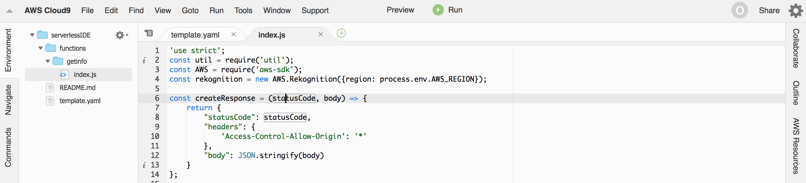

Let's have a look at the code. It contains a `handler` function that is executed when the Lambda function is invoked. The first part of the function retrieves, from the input event, the bucket name and object key that identify where the image to process is located.

```javascript
...
...
exports.handler = (event, context, callback) => {
    const body = JSON.parse(event.body);
    const srcBucket = body.bucket;
    const srcKey = decodeURIComponent(body.key ? body.key.replace(/\+/g, " ") : null); 

    ...
    ...
};
``` 


The second part invokes [Amazon Rekognition detecLabels function](https://docs.aws.amazon.com/AWSJavaScriptSDK/latest/AWS/Rekognition.html#detectLabels-property) to detect real-world entities (labels) within an image provided as input.

```javascript
...
...
exports.handler = (event, context, callback) => {
    ...
    ...
    var params = {
        Image: {
            S3Object: {
                Bucket: srcBucket,
                Name: srcKey 
            }
        }
    };
    setTimeout(function(){
        rekognition.detectLabels(params).promise().then(function (data) {
            console.log(createResponse(200, data.Labels));
            callback(null, createResponse(200, data));
        }).catch(function (err) {
            callback(null, createResponse(err.statusCode, err));
    })},3000);
};
``` 

As a last step, on the right-hand side of the *Editor pane* Click on *AWS Resources* and verify that you have a new Lambda function on the *Local Functions* tree, as shown below.


## 2.3. Test your serverless API locally

Now it is time to test and debug our API locally before we commit/push changes to the source code repository.  

To the right of the *Editor pane* Click on *AWS Resources*. Locate your local Lambda function, right click on it and select *Run Local*.

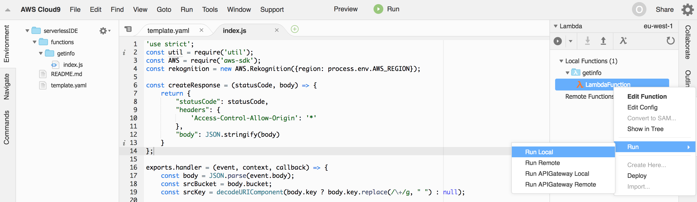

This will open a new run tests tab on the *Editor pane* with the title *[λ] LambdaFunction*

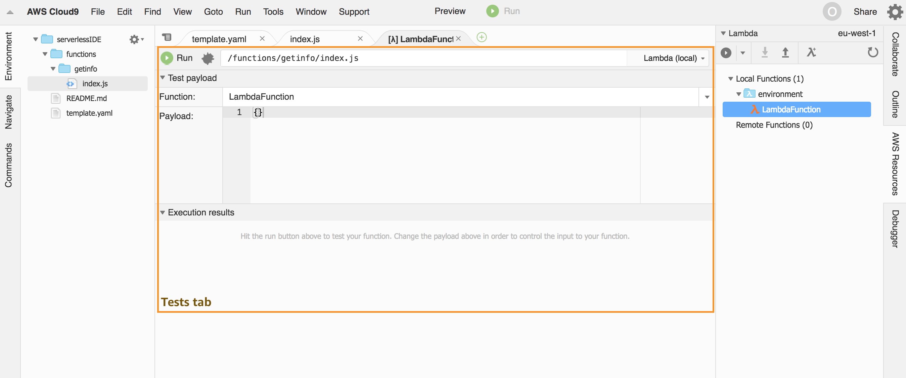

Notice a drop-down list on the top-right corner of the tests tab. Click the arrow icon and learn about the different tests available.

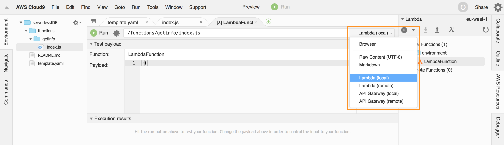

* *Lambda (local)*, leverages [SAM local](https://github.com/awslabs/aws-sam-local) to run your Lambda function locally 
* *API Gateway (local)*, leverages [SAM local](https://github.com/awslabs/aws-sam-local) to run a local version of your API
* *Lambda (remote)*, the IDE sends an event to a Lambda function already deployed to your AWS acccount
* *API Gateway (remote)*, the IDE sends a request to an API already deployed to your AWS account

Let's start with *Lambda (local)* so, please, double-check it is selected from the drop-down list.

Before we run a test we need to specify the payload that is going to be used to trigger the function. Since we are now testing the Lamba function directly, we need a test event as the Lambda function expects. Our Lambda function is proxied by an API Gateway API, so the event follows the structure specified at [API Gateway Proxy Request Event](https://docs.aws.amazon.com/lambda/latest/dg/eventsources.html#eventsources-api-gateway-request)

For the sake of simplicity you can copy and paste the example below to the *Payload* text area. Just make sure you replace `<YOUR-FRONTEND-BUCKET-NAME>` with the bucket name that hosts your front-end web application.

```json
{
  "body": "{\"bucket\": \"<YOUR-FRONTEND-BUCKET-NAME>\",\"key\": \"img/uploads/someguy.jpg\"}",
  "resource": "/",
  "path": "/",
  "httpMethod": "POST",
  "headers": null,
  "queryStringParameters": {},
  "pathParameters": null,
  "stageVariables": null,  
  "requestContext": {
    "path": "/",
    "stage": "prod",
    "requestId": "c6af9ac6-7b61-11e6-9a41-93e8deadbeef",
    "resourcePath": "/",
    "httpMethod": "POST",
    "apiId": "1234567890",
    "accountId": "1234567890",
    "resourceId": "123456"
  },
  "isBase64Encoded": false
}
```

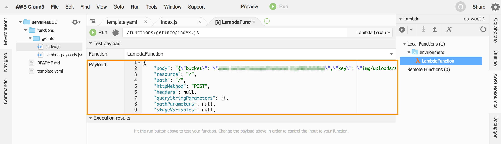

<details>
<summary>You can generate sample events easily with SAM local. Expand to learn more</summary>
<p>
Sample test events can also be generated with the `generate-event` command of the [SAM local](https://github.com/awslabs/aws-sam-local) command line interface:

```bash
sam local generate-event
NAME:
   sam local generate-event - Generates Lambda events (e.g. for S3/Kinesis etc) that can be piped to 'sam local invoke'

USAGE:
   sam local generate-event command [command options] [arguments...]

COMMANDS:
     s3        Generates a sample Amazon S3 event
     sns       Generates a sample Amazon SNS event
     kinesis   Generates a sample Amazon Kinesis event
     dynamodb  Generates a sample Amazon DynamoDB event
     api       Generates a sample Amazon API Gateway event
     schedule  Generates a sample scheduled event

OPTIONS:
   --help, -h  show help
```
</p>
</details>

Execute a test by clicking the run button 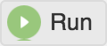. The *Execution results* area will show the function response. The `body` attribute is a list of labels detected with its corresponding confidence score. Along with that, it also shows the memory used by the Lambda function and the time it took to execute.

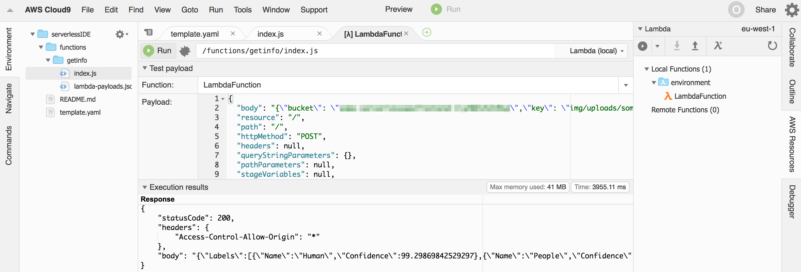

<details>
<summary>You can also debug your functions with Cloud9. Expand to learn more</summary>
<p>
You can also enable the debugger by clicking the debug icon . It will change color to light green, meaning that debugging is enabled.
You can toggle breakpoints on the `index.js` file by clickinng right to the left of the line number where you want the breakpoint to be set. The line is decorated with a red circle.

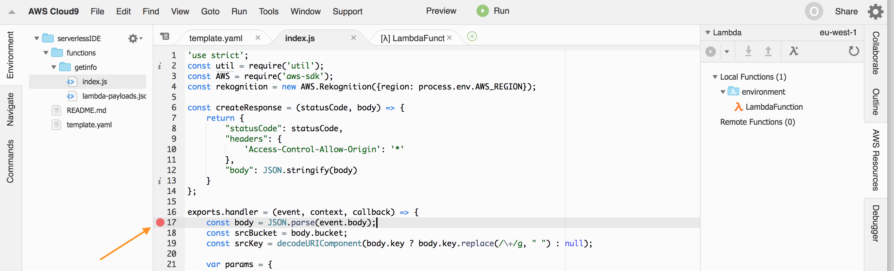

Execute a new test and wait until the debugger pane shows up.

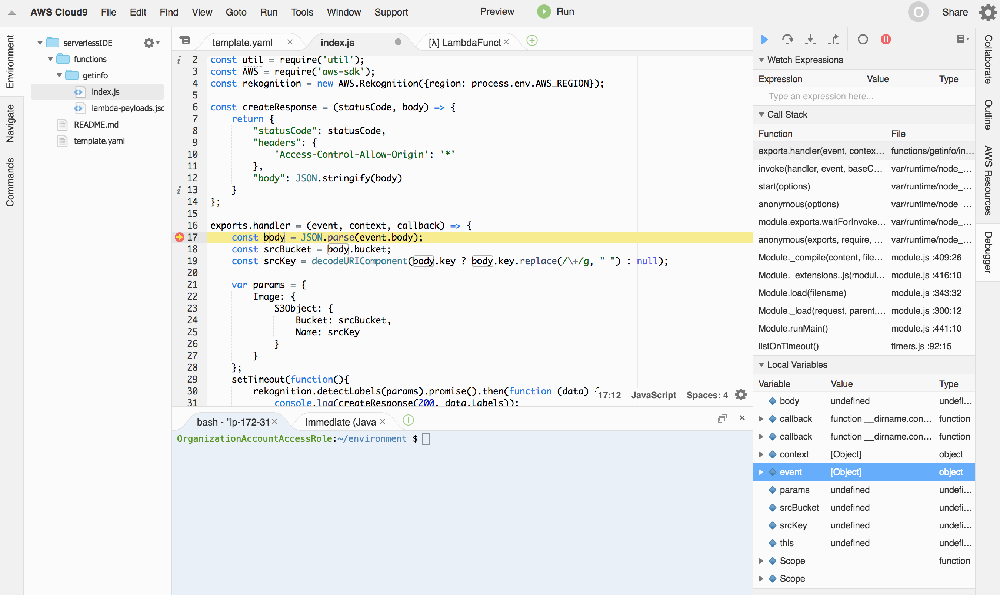
</p>
</details>

Finally, you can also invoke the API locally. On the test tab, change from *Lambda (local)* to *API Gateway (local)* 

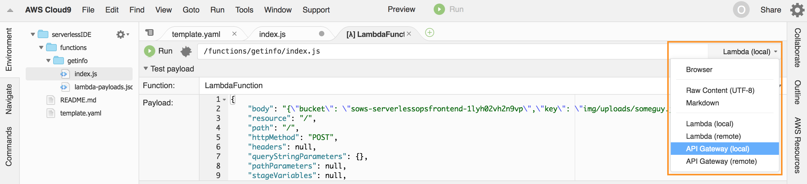

Set the *Body* text area as follows (replace `<YOUR-FRONTEND-BUCKET-NAME>` with the bucket name that hosts your front-end web application):

```json
{
  "bucket": "<YOUR-FRONTEND-BUCKET-NAME>",
  "key": "img/uploads/someguy.jpg"
}
```
Execute a test by clicking the run button . The *Execution results* area will show the function response. 

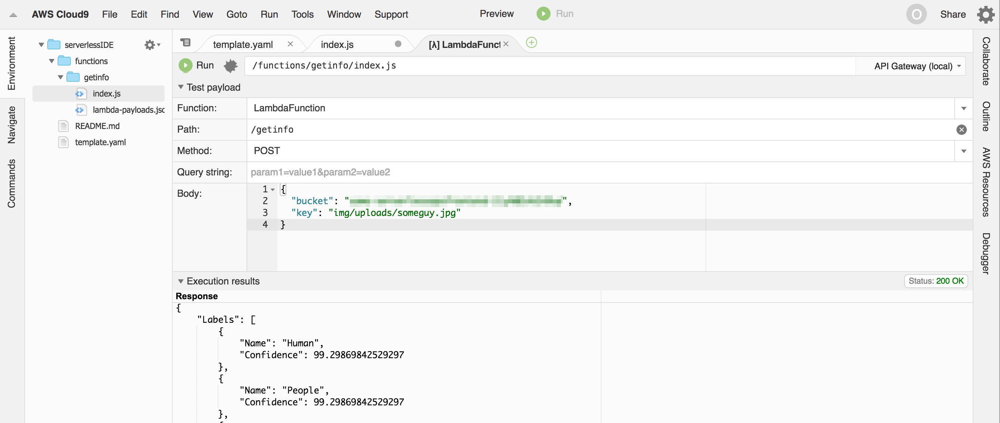


## 2.4. Push changes to your repo

The AWS Cloud9 IDE has a built-in terminal window that can interactively run CLI commands. We will use that terminal to connect to the CodeCommit Git repository you created on the previous section.

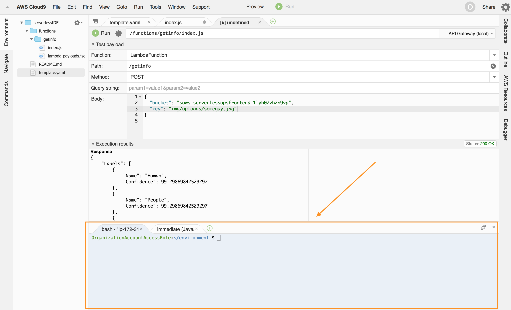

First, we need to configure valid credentials to log into the CodeCommit Git repo. There a number of ways to do so that are described in the [Setting up section of the AWS CodeCommit documentation](https://docs.aws.amazon.com/codecommit/latest/userguide/setting-up.html). 

Here we are going to use the AWS CodeCommit credential helper, that allows Git to use HTTPS and a cryptographically signed version of your IAM credentials to interact with AWS CodeCommit repositories. Go to the terminal window and execute the following Git commands.

```bash
git config --global credential.helper '!aws codecommit credential-helper $@'
git config --global credential.UseHttpPath true
```
Now connect your AWS Cloud9 development environment with the CodeCommit repo you created on the previous section:

```bash
git init
git remote add origin <YOUR-CODECOMMIT-REPO-URL>
git fetch
```

AWS Cloud9 uses a metadata hidden folder called `.c9` that we do not want to add to the CodeCommit repo. Create a `.gitignore` file containing the folder name:

```bash
echo ".c9" > .gitignore
```

Commit/push your local changes:

```bash
git add -A
git commit -m "Initial commit"
git push origin master
```

After that, go back to your CodeCommit repository and verify you have your files there.

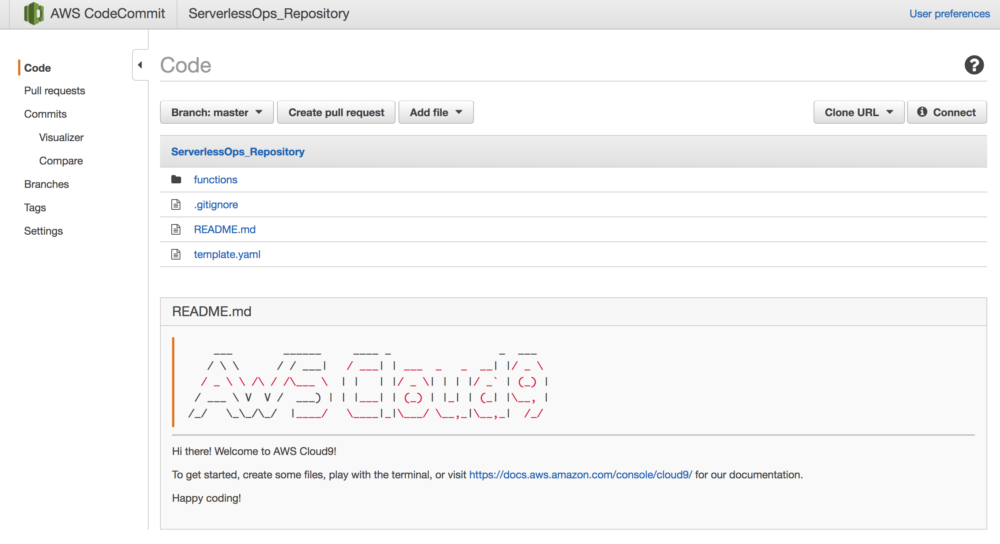


### Congratulations! You completed this section

[Back to home page](../../README.md)


