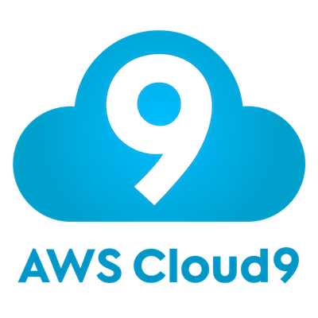
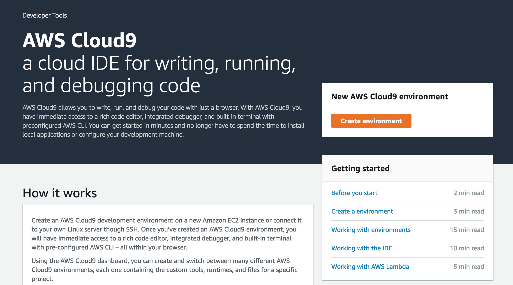
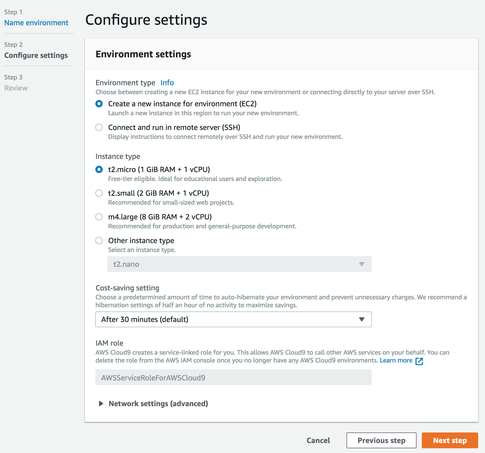
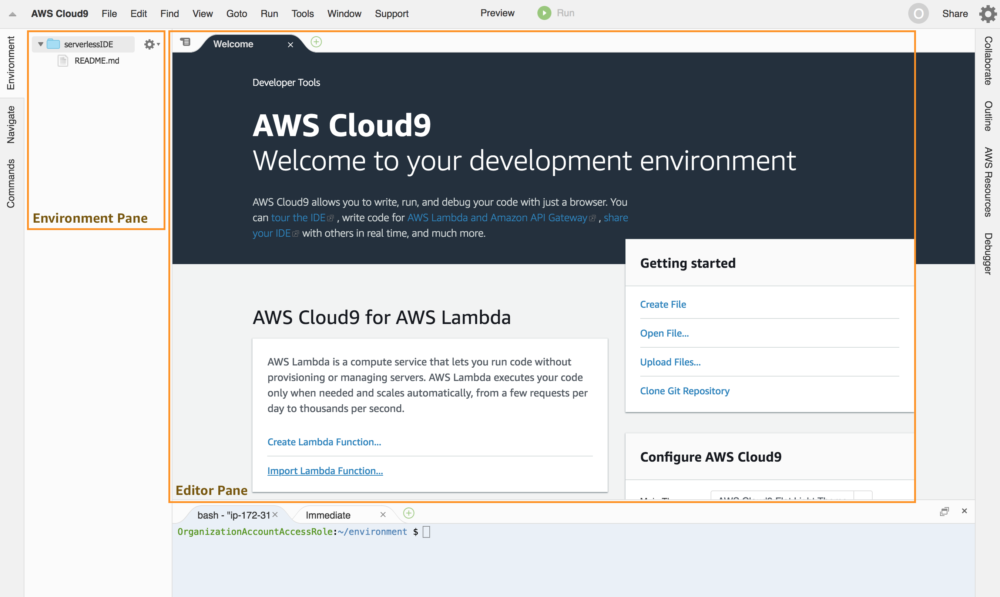
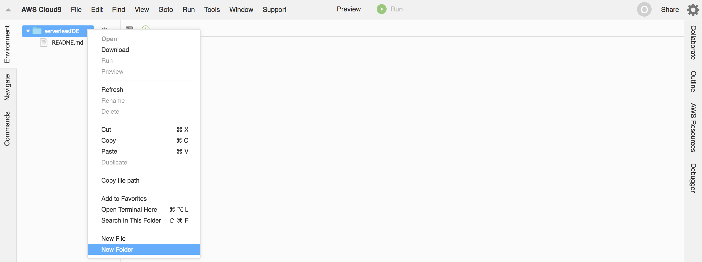
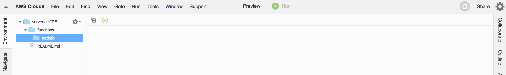
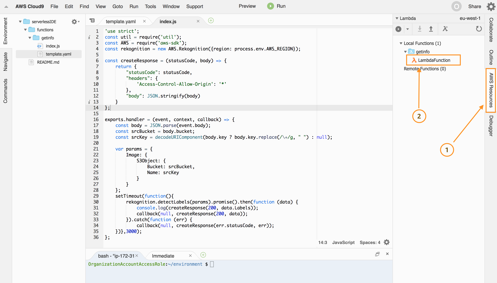
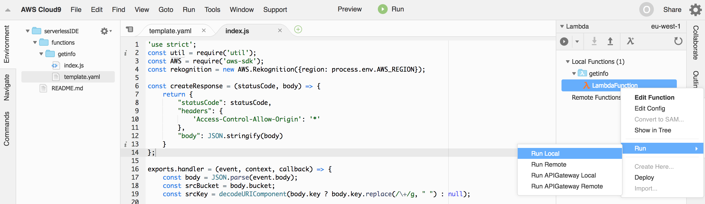

# 2. Develop with Cloud9

In this section, you are going to use [AWS Cloud9](https://aws.amazon.com/cloud9/) to code, test and debug your serverless API. 

[AWS Cloud9](https://aws.amazon.com/cloud9/) is a full-fledged cloud-based integrated development environment (IDE) that lets you write, run, and debug your code with just a browser. It comes prepackaged with essential tools for popular programming languages, including Node, Python, PHP, Java and more.

[AWS Cloud9](https://aws.amazon.com/cloud9/) integrates seamslessly with serverless applications on the AWS platform by leveraging the [AWS Serverless Application Model](https://github.com/awslabs/serverless-application-model) - SAM - to streamline the definition of serverless APIs, and [SAM local](https://github.com/awslabs/aws-sam-local) to allow you to easily test and debug your API locally.

<center>
<a href="https://aws.amazon.com/cloud9/" target=_blank></a>
&nbsp;&nbsp;&nbsp;&nbsp;&nbsp;&nbsp;
<a href="https://github.com/awslabs/serverless-application-model" target=_blank></a>
</center>

## 2.1. Create your cloud-based development environment

Navigate to the [AWS Cloud9 management console](https://console.aws.amazon.com/cloud9/home). Make sure the AWS Region selector matches the one you have been working with so far. 

Click **Create Environment**.



On the *Name environment* page set *Name* to `serverlessIDE` and click **Next step**.

On the *Configure settings* you specify the instance type that your cloud IDE is going to be running on, the idle time it will wait until it auto-hibernates (cost savings) and the network characterization (VPC). Leave all the defaults and click **Next step**



The *Review* page summarizes the characteristics of your Cloud9 environment. Proceed to provisioning it by clicking **Create environment**. After a couple of minutes your cloud-based IDE will be ready to go.



It looks pretty much like any IDE you are used to, doesn't it? 

The *Environment pane*, on the left side of the screen, shows a list of folders and files in your project. The *Editor pane*, on the right, is where you will write, test and debug code.  

## 2.2. Create your serverless API

On the *Environment pane* right click over the root folder and select **New Folder**.



Specify `functions` as folder name. Right click over the `functions` folder to create another one called `getinfo`.



Right click on the `serverlessIDE` root folder and select *New file*. Name it `template.yaml`. This is the YAML-formated SAM template that describes your serverless API. Double click on in to open the editor. On the *Editor pane* paste the contents on the file [template.yaml](../../template.yaml)

Right click again on the `getinfo` folder and select *New file*. Name it `index.js`. This will be the source code for your serverless API. Double click on `index.js` to open the editor. On the *index.js* tab on the *Editor pane* paste the contents on the file [index.js](../../functions/getinfo/index.js)

Inspect the code. It contains a `handler` function that is executed when the Lambda function is invoked. The first part of the function retrieves, from the input event, the bucket name and object key that identify where the image to process is located.

```javascript
...
...
exports.handler = (event, context, callback) => {
    const body = JSON.parse(event.body);
    const srcBucket = body.bucket;
    const srcKey = decodeURIComponent(body.key ? body.key.replace(/\+/g, " ") : null); 

    ...
    ...
};
``` 


The second part invokes [Amazon Rekognition detecLabels function](https://docs.aws.amazon.com/AWSJavaScriptSDK/latest/AWS/Rekognition.html#detectLabels-property) to detect real-world entities (labels) within an image provided as input.

```javascript
...
...
exports.handler = (event, context, callback) => {
    ...
    ...
    var params = {
        Image: {
            S3Object: {
                Bucket: srcBucket,
                Name: srcKey 
            }
        }
    };
    setTimeout(function(){
        rekognition.detectLabels(params).promise().then(function (data) {
            console.log(createResponse(200, data.Labels));
            callback(null, createResponse(200, data));
        }).catch(function (err) {
            callback(null, createResponse(err.statusCode, err));
    })},3000);
};
``` 

To the right of the *Editor pane* Click on *AWS Resources* and verify that you have a new Lambda function on the *Local Functions* tree, as shown below.




## 2.3. Test and debug your serverless API

To the right of the *Editor pane* Click on *AWS Resources*. Locate your local Lambda function, right click on it and select *Run Local*.



This will open a new run tests tab on the *Editor pane*.


Notice a drop-down list on the top-right corner of the tests tab. Click the arrow icon and learn about the different tests available:

* Lambda (local), leverages [SAM local](https://github.com/awslabs/aws-sam-local) to run your Lambda function locally 
* Lambda (remote), the IDE sends an event to a Lambda function deployed on your AWS acccount
* API Gateway (local), leverages [SAM local](https://github.com/awslabs/aws-sam-local) to run a local version of your API
* API Gateway (remote), the IDE sends a request to an API deployed on your AWS account

Let's start with *Lambda (local)* so, please, make sure it is selected from the drop-down list.


Let's move our attention to the top-left area of the tests tab. The run icon starts the execution. Immediatly to the right of it you will see a debug icon gray. By clicking on it, it will change color to light green, meaning that debugging is enabled. Leave debug disabled for now.


Last, but not the list, the test tab allows us to specify the payload that is going to be used to trigger the function/API. Since we are now testing the Lamba function directly, we need a test event as the Lambda function expects. Our Lambda function is proxied by an API Gateway API, so the event looks like this.


**Note:** You can generate sample events using the `generate-event` command of the [SAM local](https://github.com/awslabs/aws-sam-local) command line interface:

`
sam local generate-event
NAME:
   sam local generate-event - Generates Lambda events (e.g. for S3/Kinesis etc) that can be piped to 'sam local invoke'

USAGE:
   sam local generate-event command [command options] [arguments...]

COMMANDS:
     s3        Generates a sample Amazon S3 event
     sns       Generates a sample Amazon SNS event
     kinesis   Generates a sample Amazon Kinesis event
     dynamodb  Generates a sample Amazon DynamoDB event
     api       Generates a sample Amazon API Gateway event
     schedule  Generates a sample scheduled event

OPTIONS:
   --help, -h  show help
`


## 2.4. Push changes to your repo

