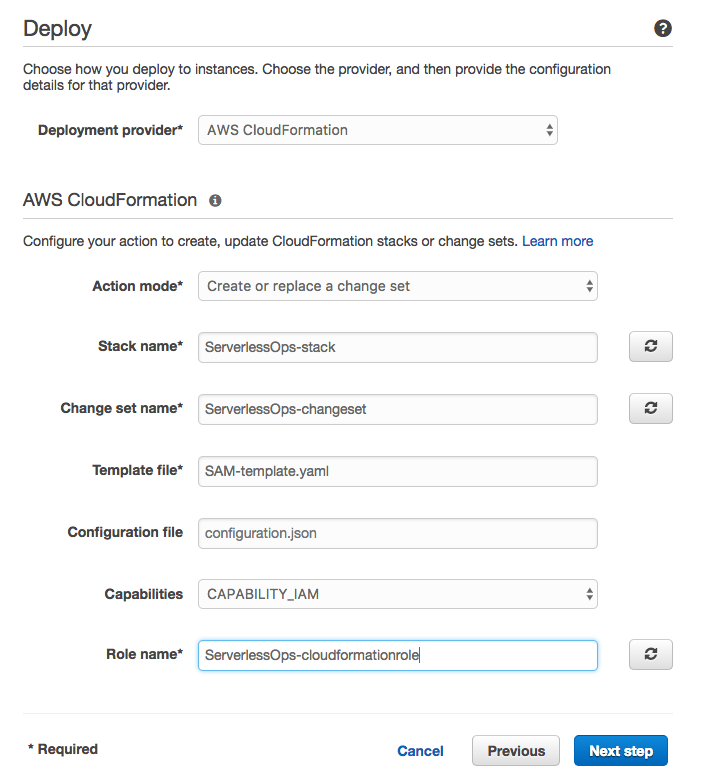

# 3. Building your CI/CD pipeline

Remember this? Let's build it!


First you need to create a file called **buildspec.yml** which will have the instructions for the pipeline builder to deploy our changes in the stage.

1. To do so, in the root folder of your repository (within Cloud9) create a file with that name.
2. Got to the [builspec.yml file](../../buildspec.yml) and copy the content to this new created file.
3. Within this buildspec.yml you will see that the build will use the bucket ```serverlessops-deploymentbucket-<your-alias-here>```. Change the ```<you-alias-here>```with the alias you selected in the first step.
3. Once you have added this, make a push to the repository:

	```bash
	git add .
	git commit -m "Adding buildspec.yml to build the pipeline"
	git push origin master
	```
	

## 3.1. Set up your pipeline with CodePipeline.

Now we are going to create our first pipeline! 

1. Go to the CodePipeline console and click on **Get Started**
2. Create a Pipeline with the name ```ServerlessOps_pipeline``` and click on next step.


### Step 3.1.1 Create the source of your pipeline.

3. Drop down the service provider and select **CodeCommit**.
4. Look for the repository name created previously and select it.
5. Select the Branch name **master**.


After defining our source, we will chose **CodeBuild** as our build provider. Click on Next Step.

### Step 3.1.2: How to create a CodeBuild project for your serveless pipeline

Here we are going to select the build provider. In this case, we will use CodeBuild.

In the phase of creating a build project, we select "Create a new build project".

Within the project, the file buildspec.yml has the information necesary for your deployments. If we inspect this file, we will find that the deployment generages a file calles SAM-template.yaml which replaces the "local code" with a file within the S3 bucket previously provided.

1. Name it as ```ServerlessOps_build```.
2. Select ```Use an image managed by AWs CodeBuild```.
3. Chose ```Ubuntu``` as the Operating system.
4. Select ```Node.js``` as the runtime.
5. Select Version ```4.3.2```.
3. Select ```Chose an existing service role from your account``` and, on that dropdown, select ```ServerlessOps-codebuildrole```. We will review it after creating the pipeline.
4. Click on *Save build project*


### Step 3.1.3: Select the deploy phase using CloudFormation.

Click on *Next Step* once you have created your build project. Altough SAM (behind the scenes) will use CodeDeploy, SAM is based in CloudFormation and the deploy will do it as well.

1. Select ```CloudFormation``` as the deployment provider.
2. Chose ```Create or replace a change set``` as the Action Mode.
3. Name the Stack ```ServerlessOps-stack```
4. Name the Change set as ```ServerlessOps-changeset```
5. The template file that CodeBuild generates is ```SAM-template.yaml```. Set it under Template file.
6. Select Capabilities ```CAPABILITIES_IAM```
7. Select the role created in *step 1* called ```ServerlessOps-cloudformationrole```.
8. Click *Next Step*.
9. In this AWS Service Role, CodePipeline should have permissions to add new stacks to *CloudFormation*, pull code from *CodeCommit*... If you don't have it, click on *Create role* and follow the steps mentioned after it.
9. Review the configuration and create the pipeline.



## 3.2. Modify your pipeline: add a ChangeSet execution Automation.

Go to the **CodePipeline** console and take a look at all the stages flowing. This might take a while but worth seeing!

After everything is in green, did it work? Have you deployed a new API? Seems like it hasn't!

You need to go to CloudFormation and Execute the [ChangeSet](https://docs.aws.amazon.com/AWSCloudFormation/latest/UserGuide/using-cfn-updating-stacks-changesets.html).

1. Select the stack *ServerlessOps-stack*. On the down panel, click on *Change sets*. 
2. Click on the Change Set called *ServerlessOps-changeset*.
2. On the new page, click on *Execute*. Accept the warning by clicking again, *Execute*.


But... This isn't pretty automatic, right? Sometimes, we might want to review all the change set before we proceed but, in this case, we want to have it all automated. To achieve it, let's add a new step to our pipeline!

1. Go to the *CodePipeline* console.
2. Select *ServelessOps_pipeline* and click *Edit*.
3. Under the stage *Staging*, click on the pen icon:

	
	
4. Click on Action and, in the new panel, add *Action category* as ```Deploy```.
5. Action name, call it ```ExecuteChangeSet```.
6. Under *Deployment provider*, select *AWS CloudFormation*.
7. Then, a new panel for CloudFormation will appear. Select Action mode *Execute a change set*, Stack name ```ServerlessOps-stack```and Change set name, ```ServerlessOps-changeset```.
8. Click on *Add action*.
9. On top of the page, click *Save pipeline changes*.


Your pipeline should look like this:


## 3.4. Try again to  push to you pipeline.

Now we have our pipeline out. Shall we start with our first deployment? Why not!

Let's go to our Lambda function (the file called functions/getinfo/index.js) and replace the code with the following:

```javascript
'use strict';
const util = require('util');
const AWS = require('aws-sdk');
const rekognition = new AWS.Rekognition({region: process.env.AWS_REGION});

const createResponse = (statusCode, body) => {
    
    return {
        "statusCode": statusCode,
        "headers": {
            'Access-Control-Allow-Origin': '*'
        },
        "body": JSON.stringify(body)
    }
};
exports.handler = (event, context, callback) => {
    const body = JSON.parse(event.body);
    const srcBucket = body.bucket;
    const srcKey = decodeURIComponent(body.key ? body.key.replace(/\+/g, " ") : null); 

    var params = {
        Image: {
            S3Object: {
                Bucket: srcBucket,
                Name: srcKey 
            }
        }
    };

    setTimeout(function(){
        rekognition.recognizeCelebrities(params).promise().then(function(result) {
        rekognition.detectLabels(params).promise().then(function (data){
            result.Labels = data.Labels;
            callback(null, createResponse(200, result));
        });
    }).catch(function (err) {
        callback(null, createResponse(err.statusCode, err));
    })},3000);    
};
```

We have added a new and awesome feature! Now we not only get the labels of each photo but we get famous labels added to our application.

Let's test the pipeline with, again:

````bash
git add -A
git commit -m "Adding famous labels to the application."
git push origin master
````

After the pipeline has propagated the change, go back to your application... Can you see the difference?

### Congratulations! You completed this section

[Proceed to next section](../../documentation/4_operations_advanced_features)

[Back to home page](../../README.md)

