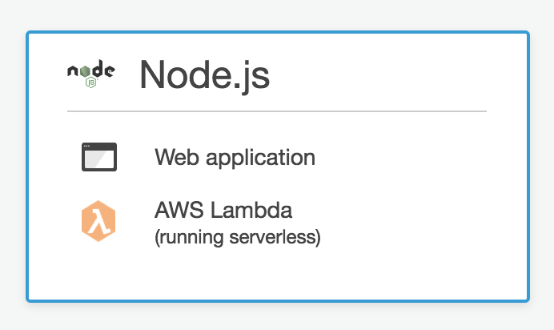

# 4. Operations: Advanced Features - WARNING: MEMES AHEAD

Now you are prepare for some advaneced features. We have created a pipeline, changed different settings and reduced the operational overhead of our deployments. It's time to execute at the most reliable level!


## 4.1 What about CodeStar?

You have successfully deployed your first pipeline from the repository till final deployment. However, I would like to share a little secret with you. All of this job is automatically done with CodeStar!

<center></center>


<details>
<summary><strong>These steps are not required for the workshop. The are just optional.</strong></summary><p>
To do so, you just need to follow these steps:

1. Go to the **CodeStar** Console.
2. Click on **+ Create a new project**.
3. Select the type of project you want to deploy. For example, during this workshop we used **Web Application**, **NodeJs**, and **AWS Lambda**.

4. Select the option left.
	
5. Select a name fo your project and chose beween CodeCommit and GitHub and click next.
6. Click on **Create Project**.

After these steps, and some more time for the project to build, you will see that the pipeline has been created! Of course, this is not required for this workshop but keep it in mind if you want to start fast and easy.

</details>


## 4.2: Blue Green Deployments

One of the most wanted features for Serverless applications is the possibility of shifting the traffic to, for example, prevent failing deployments to impact your application entirely. Some others like to shift the traffic to monitor if their infrastructure (behind the scenes) can stand it.

With Lambda, you can easily create this traffic shifting feature with just a few lines of SAM code:

### 4.2.1: Update your deployment preference

1. Go to the file *template.yaml* and uncomment these lines:

	```yaml
	DeploymentPreference:
		Type: Linear10PercentEvery1Minute
	```

2. We need to perform a visible change on our infrastructure to see how it works. Change your function code to this in your development environment.

	```javascript
	'use strict';
	const util = require('util');
	const AWS = require('aws-sdk');
	const rekognition = new AWS.Rekognition({region: process.env.AWS_REGION});


	const createResponse = (statusCode, body) => {

	    return {
	        "statusCode": statusCode,
	        "headers": {
	            'Access-Control-Allow-Origin': '*'
	        },
	        "body": JSON.stringify(body)
	    }
	};
	exports.handler = (event, context, callback) => {
	    const body = JSON.parse(event.body);
	    const srcBucket = body.bucket;
	    const srcKey = decodeURIComponent(body.key ? body.key.replace(/\+/g, " ") : null);

	    var params = {
	        Image: {
	            S3Object: {
	                Bucket: srcBucket,
	                Name: srcKey
	            }
	        }
	    };

	    setTimeout(function(){
	        rekognition.recognizeCelebrities(params).promise().then(function(result) {
	            rekognition.detectText(params).promise().then(function (detectedtext){
	                result.TextDetections = detectedtext;
	                rekognition.detectLabels(params).promise().then(function (labels){
	                    result.Labels = labels;
	                    callback(null, createResponse(200, result));
	                });
	            });
	    }).catch(function (err) {
	        callback(null, createResponse(err.statusCode, err));
	    })},3000);
	};
	```

Now, let's do a deployment!


### 4.2.2: Update your code to force a release!

Let's make our release. As we did on previous steps, we will do it directly from the console/git command:

1. Run the following git commands:

	```
	git add -A
	git commit -m "My first b/g commit! - ServerlessOps"
	git push
	```

2. Go to CodeDeploy and select the deployment that starts with ServerlessOps-stack.
3. Under status, you should see an identifies starting with "d-". Click it.


We are shifting traffic 10% each minute! This has been done using 2 lines on SAM. How awesome it is?

You can run tests (different requests) against the application to find see the different results. Sometimes it will give you the labels and sometime, text found on the picture!

### 4.2.3 OPTIONAL - Use hooks and alarms.
<details>
<summary><strong>Optional Blue/Green deployment exercise (expand for details)</strong></summary><p>
Now that you have seen how easy is to deploy with blue green deployments, you might want to investigate hooks and alarms to monitor and trigger automated rollback of your deployments.

```yaml
Alarms:
	# A list of alarms that you want to monitor
	- !Ref AliasErrorMetricGreaterThanZeroAlarm
	- !Ref LatestVersionErrorMetricGreaterThanZeroAlarm
```

During traffic shifting, if any of the CloudWatch Alarms go to Alarm state, CodeDeploy will immediately flip the Alias back to old version and report a failure to CloudFormation.

If you want to implement this feature, you can start by creating an alarm and prepare and reference it in your *template.yaml*. Then, using [set-alarm-state](https://docs.aws.amazon.com/cli/latest/reference/cloudwatch/set-alarm-state.html) you can change it into *ALARM* and rollback the deployment you want.


```yaml
Hooks:
	# Validation Lambda functions that are run before & after traffic shifting
	PreTraffic: !Ref PreTrafficLambdaFunction
	PostTraffic: !Ref PostTrafficLambdaFunction
```

Before traffic shifting starts, CodeDeploy will invoke the PreTraffic Hook Lambda Function. This Lambda function must call back to CodeDeploy with an explicit status of Success or Failure, via the [PutLifecycleEventHookExecutionStatus](https://docs.aws.amazon.com/codedeploy/latest/APIReference/API_PutLifecycleEventHookExecutionStatus.html) API. On Failure, CodeDeploy will abort and report a failure back to CloudFormation. On Success, CodeDeploy will proceed with the specified traffic shifting.

If you want to implement this feature, you can create a Lambda function based on [this one](https://github.com/awslabs/serverless-application-model/blob/master/examples/2016-10-31/lambda_safe_deployments/preTrafficHook.js). For example, for the shake of this workshop, you can use a random choice such as **1** equals, it's validated, **0** has failed. Here is, for example, a pice of the code you might want to use:

```javascript
var rand_status = 'Succeeded';
if(Math.floor(Math.random() * Math.floor(2)) < 0){
	rand_status = 'Failed';
}

var params = {
    deploymentId: deploymentId,
    lifecycleEventHookExecutionId: lifecycleEventHookExecutionId,
    status: rand_status
};
```

Or if you want to go beyond that, try to build your first integration test!

</p></details>

## 4.3. API Gateway Canary releases.

Sure, we have tested how to perform incremental deployments on our code but, when we do changes on our API, often, we need to test it first. Our customers love Canary testing because it allows them to test their API changes with real traffic yet it won't impact heavily their customer experience.

With API gateway, you can deploy these changes easily on an percentage of resources going to your API by using the API Gateway canary release option.

To do so, follow these steps:

1. Go to the API Gateway console and click on *Stages* of the *ServerlessOps-api*.
2. Click on the Stage where you want to add Canary. In this case, *Prod*.
2. Click on the *Canary* tab.
3. Click on *Create canary*.
4. Under *Percentage of requests directed to Canary* edit it and put 10%. This will route 10% of your traffic to the Canary release of your API.
	
6. Now, let's make a change to be promoted. Under the same API go to *Gateway Response*.
7. Look for *Missing Authentication Token* and open it. The Body Mapping Template should look like this:

	```bash
	{"message":$context.error.messageString}
	```

8. Change it to this:

	```bash
	{"message-customized":$context.error.messageString}
	```
9. Click on *Save*.
10. Now, click on *Resources*, *Actions* and click *Deploy API*.
11. Select the API Stage Prod. It will prompt a message saying that the canary release is enabled on this Stage. Click *Deploy*.

Now, let's test this feature:

1. Use the following command with the appropiate parameters for your API:

``` bash
curl -X POST   https://<api-id>.execute-api.us-east-1.amazonaws.com/Prod/a-ramdom-name-that-will-trigger-403 'Content-Type: application/json' -d '{ "bucket": "serverlessops-step0-stack-serverlessopsfrontend-<bucket-id>","key": "someguy.jpg"}'
```
Didn't work? Are you seeing the "message-customized" response? Of course not! you need to try to several times since only 10% of the traffic is going to the canary! Try a little harder.


Now what? Did it work? Of course! We are ready to promote this Canary to release version. Go to *Stages > Prod > Canary* and click on Promote Canary and then OK.


Then, test a few *curls* more.

It might take a while to propagate all the changes but you will see that, after a few attempts, all the responses have the *message-customized* response.

## 4.3. Lambda Concurrency.

AWS Lambda limits your concurrency to 1000 concurrent executions within one region. Of course, these limits can be updated by requesting a limit increase to our support team. However, it is always a good idea to limit your functions to certain amount of concurrent executions.

Let's put an example: We have our own environment with several developers pushing code and testing lambda functions. We are deeply into Serverless! Some of these functions are just for testing purposes but one of our developers is doing a load test to see how does it react to heavy load. Because of this, his tesing lambda function is taking 900 concurrent executions letting only 100 left for the rest of your Lambda functions. Luckily, you followed the best practices and split testing and production in two different accounts so this is not impacting your production environment but, of course, the rest of the developers are seeing 429 in the Lambda execution whenever they trigger their functions. You got several angry developers!

Another use case would be to "reserve" capacity for our Lambda function so other Lambda executions won't take these.

For the purpose of this workshop, we are going to limit the concurrency of our function to 25. You probably noticed in the code that there is "wait" of 3000 seconds.

```JAVASCRIPT
setTimeout(function(){...
},3000);
```
This has been made on purpose to force your Lambda function to have concurrent executions.

Let's test our Lambda Function without concurrency. To do it, we recommend you to use an EC2 instance so you can install hey easily.

```bash
## If you don't have go installed:
sudo yum install go -y
## mac with brew
brew install go
##

go get -u github.com/rakyll/hey

./go/bin/hey -n 5000 -c 50 -d '{ "bucket": "serverlessops-step0-stack-serverlessopsfrontend-<your-alias-here>","key": "someguy.jpg"}' -H 'Content-Type: application/json' -m POST https://<your-api-endpoint>/Prod/getinfo
```

Yoy should see the a result like this:

```bash
Response time histogram:
  5.452 [1]	|
  5.973 [3626]	|∎∎∎∎∎∎∎∎∎∎∎∎∎∎∎∎∎∎∎∎∎∎∎∎∎∎∎∎∎∎∎∎∎∎∎∎∎∎∎∎
  6.493 [1095]	|∎∎∎∎∎∎∎∎∎∎∎∎
  7.014 [185]	|∎∎
  7.534 [55]	|∎
  8.055 [24]	|
  8.575 [6]	|
  9.096 [3]	|
  9.616 [1]	|
  10.137 [2]	|
  10.658 [2]	|

Status code distribution:
  [200]	5000 responses
```

Let's enable concurrency in your Lambda. To do so, we will implement it via SAM. We are going to remove the blue green deployment and add a line for concurrency reserverd executions. Uncomment the line `ReservedConcurrentExecutions` Your Lambda Function in SAM should look like this:

```yaml
LambdaFunction:
   Type: AWS::Serverless::Function
   Properties:
      CodeUri: functions/getinfo
      Description: "Backend Lambda for Serverless Ops Workshop"
      Handler: index.handler
      Timeout: 60
      Policies:
        - AmazonRekognitionFullAccess
        - AmazonS3ReadOnlyAccess
      Runtime: nodejs4.3
      Events:
        ProxyApiRoot:
          Type: Api
          Properties:
            RestApiId: !Ref ApiGatewayApi
            Path: /getinfo
            Method: POST
      AutoPublishAlias: live
      ReservedConcurrentExecutions : 25
```

Seems like CloudFormation in SAM doesn't work right now:

 - aws lambda put-function-concurrency --function-name ServerlessOps-stack-LambdaFunction-<your-alias> --reserved-concurrent-executions 25

Now, as always, let's deploy it through our pipeline.

```bash
git add -A
git commit -m "Adding concurrecy limits"
git push
```
After the change is propagated, we can review it on our AWS Lambda console.

It is important to understand that this concurrency is shared between all the aliases and versions of this function. Lambda concurrency is function based.

To test this concurrency, let's go to our terminal and run the previous command command.


```bash
./go/bin/hey -n 5000 -c 50 -d '{ "bucket": "serverlessops-step0-stack-serverlessopsfrontend-<your-alias-here>","key": "someguy.jpg"}' -H 'Content-Type: application/json' -m POST https://<your-api-endpoint>/Prod/getinfo
```

You will see something like this:

```bash
Response time histogram:
  0.083 [1]	|
  1.548 [500]	|∎∎∎∎∎∎∎∎∎∎∎∎∎∎∎∎∎∎∎∎∎∎∎∎∎∎∎∎∎∎∎∎∎∎∎∎∎∎∎∎
  3.012 [0]	|
  4.476 [457]	|∎∎∎∎∎∎∎∎∎∎∎∎∎∎∎∎∎∎∎∎∎∎∎∎∎∎∎∎∎∎∎∎∎∎∎∎∎
  5.941 [15]	|∎
  7.405 [5]	|
  8.869 [1]	|
  10.334 [0]	|
  11.798 [0]	|
  13.262 [3]	|
  14.727 [18]	|∎

  ...
  Status code distribution:
  [502]	501 responses
  [200]	499 responses
```
As we can see here, the 502's responses has increased!

https://docs.aws.amazon.com/AWSCloudFormation/latest/UserGuide/aws-resource-lambda-function.html#cfn-lambda-function-reservedconcurrentexecutions

## 4.4. Integration tests.

In this section we will extend the deployment pipeline we built in the previous section to include an automatic integration test step so we can improve our confidence on the changes being continuously introduced before them reach our production environment.

The changes that we will introduce will basically add a pre-production (also known as QA or staging) environment so we can deploy the new version of our infrastructure/application to this new environment, run the integration tests again this just-deployed version and, only if tests succeeds, proceed with the deployment to our production environment.

Our integration test will be implemented using a new lambda function that will execute an HTTP request against the API Gateway endpoint (so the production lambda code will be executed and the invocation to Recognition as well) using a previously uploaded input (i.e. an image available in our S3 bucket corresponding to a well known celebrity) and validate that the HTTP response is okay (i.e. status code is 200) and the response contains the name expected celebrity.
